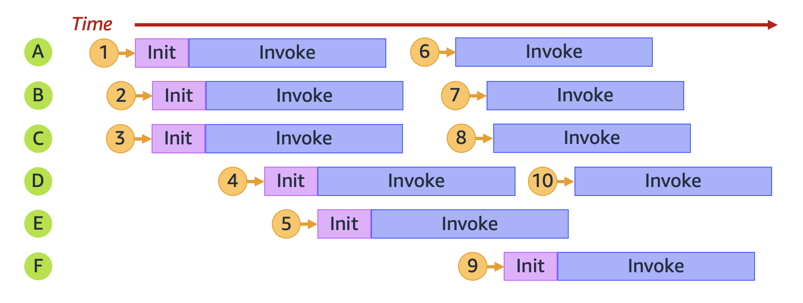
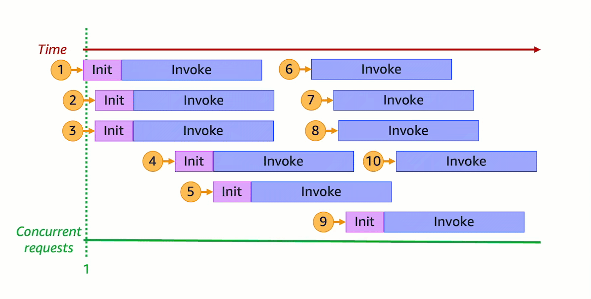
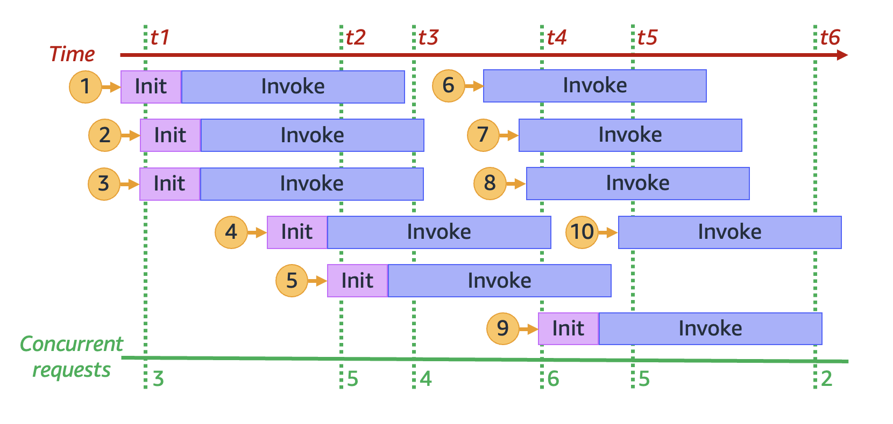
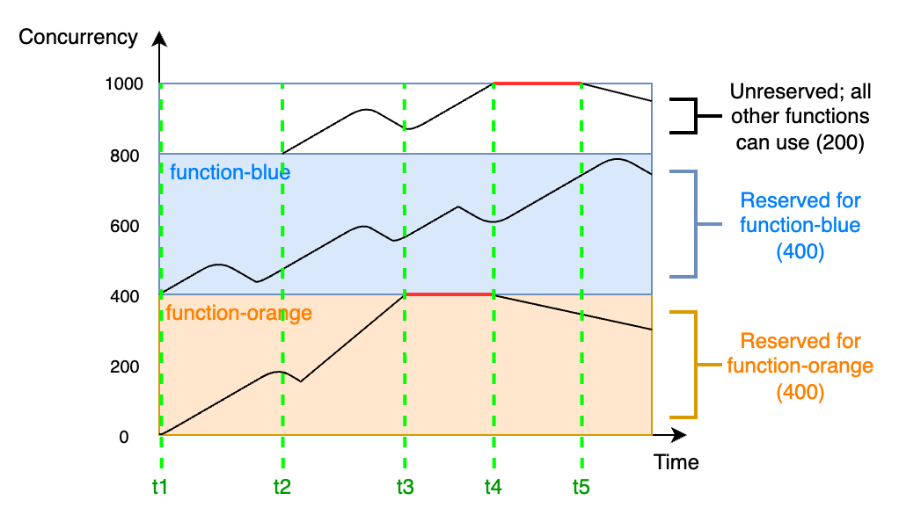
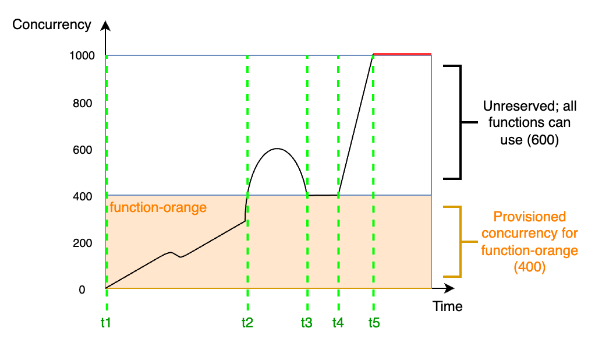
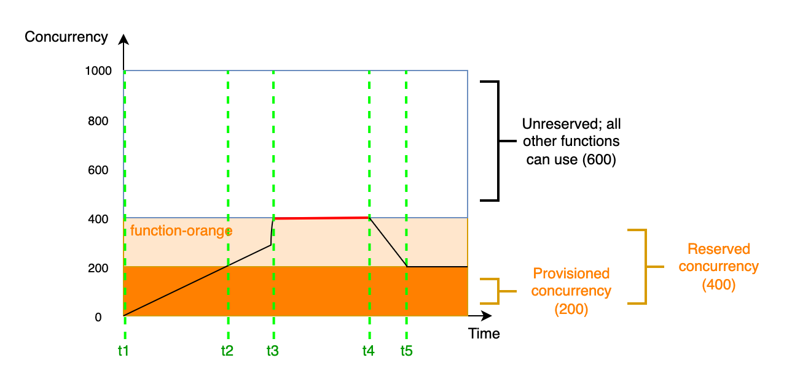

# 了解 Lambda 函数扩展

[原文链接]([了解 Lambda 函数扩展 - AWS Lambda](https://docs.aws.amazon.com/zh_cn/lambda/latest/dg/lambda-concurrency.html))

**并发**是您的 AWS Lambda 函数同时处理的正在进行的请求数。对于每个并发请求，Lambda 会预置单独的执行环境实例。当您的函数收到更多请求时，Lambda 会自动处理执行环境数量的扩展，直到您达到账户的并发限制。默认情况下，Lambda 为您的账户提供的一个 AWS 区域 中所有函数总并发上限为 1000 个并发执行。为了支持您的特定账户需求，您可以[申请增加限额](https://aws.amazon.com/premiumsupport/knowledge-center/lambda-concurrency-limit-increase/)，并配置函数级并发控制，这样您的关键函数就不会节流。

本主题介绍了 Lambda 中的并发概念和函数横向缩减。在本主题结束时，您将能够了解如何计算并发、如何可视化两个主要的并发控制选项（预留类和预置类）、估计适当的并发控制设置，以及查看用于进一步优化的指标。

###### Sections

- [了解和可视化并发](https://docs.aws.amazon.com/zh_cn/lambda/latest/dg/lambda-concurrency.html#understanding-concurrency)
- [计算函数的并发](https://docs.aws.amazon.com/zh_cn/lambda/latest/dg/lambda-concurrency.html#calculating-concurrency)
- [了解预留并发和预置并发](https://docs.aws.amazon.com/zh_cn/lambda/latest/dg/lambda-concurrency.html#reserved-and-provisioned)
- [了解并发和每秒请求数](https://docs.aws.amazon.com/zh_cn/lambda/latest/dg/lambda-concurrency.html#concurrency-vs-requests-per-second)
- [并发限额](https://docs.aws.amazon.com/zh_cn/lambda/latest/dg/lambda-concurrency.html#concurrency-quotas)
- [为函数配置预留并发](https://docs.aws.amazon.com/zh_cn/lambda/latest/dg/configuration-concurrency.html)
- [为函数配置预置并发](https://docs.aws.amazon.com/zh_cn/lambda/latest/dg/provisioned-concurrency.html)
- [Lambda 扩展行为](https://docs.aws.amazon.com/zh_cn/lambda/latest/dg/scaling-behavior.html)
- [监控并发](https://docs.aws.amazon.com/zh_cn/lambda/latest/dg/monitoring-concurrency.html)

## 了解和可视化并发

Lambda 调用一个安全和隔离的[执行环境](https://docs.aws.amazon.com/zh_cn/lambda/latest/dg/lambda-runtime-environment.html)中的函数。要处理请求，Lambda 必须先初始化执行环境（[Init 阶段](https://docs.aws.amazon.com/zh_cn/lambda/latest/dg/lambda-runtime-environment.html#runtimes-lifecycle-ib)），然后再使用它来调用您的函数（[Invoke 阶段](https://docs.aws.amazon.com/zh_cn/lambda/latest/dg/lambda-runtime-environment.html#runtimes-lifecycle-invoke)）：


###### 注意

实际的 Init 和 Invoke 持续时间可能因多种因素而异，例如您选择的运行时和 Lambda 函数代码。前面的图的目的并不是表示 Init 和 Invoke 阶段持续时间的确切比例。

上图使用矩形表示单个执行环境。当函数收到其第一个请求（由带标签 `1` 的黄色圆圈表示）时，Lambda 会创建一个新的执行环境并在初始化阶段在主处理程序之外运行代码。然后，Lambda 在 Invoke 阶段运行函数的主处理程序代码。在整个过程中，此执行环境繁忙，无法处理其他请求。

当 Lambda 处理完第一个请求后，此执行环境就可以处理针对同一函数的其他请求。对于后续请求，Lambda 无需重新初始化环境。


在上图中，Lambda 重复使用执行环境来处理第二个请求（由带标签 `2` 的黄色圆圈表示）。

到目前为止，我们只关注您的执行环境的单个实例（即并发为 1）。实际上，Lambda 可能需要并行预置多个执行环境实例来处理所有传入请求。当您的函数收到新请求时，可能会发生以下两种情况之一：

- 如果预初始化的执行环境实例可用，Lambda 会使用它来处理请求。
- 否则，Lambda 会创建一个新的执行环境实例来处理请求。

例如，让我们来看看当您的函数收到 10 个请求时会发生什么：




在上图中，每个水平平面代表一个执行环境实例（标记为从 `A` 到 `F`）。以下是 Lambda 处理每个请求的方式：

| 请求 | Lambda 行为      | Reasoning                                                    |
| :--- | :--------------- | :----------------------------------------------------------- |
| 1    | 预置新环境 **A** | 这是第一个请求；没有可用的执行环境实例。                     |
| 2    | 预置新环境 **B** | 现有执行环境实例 **A** 繁忙。                                |
| 3    | 预置新环境 **C** | 现有执行环境实例 **A** 和 **B** 都繁忙。                     |
| 4    | 预置新环境 **D** | 现有执行环境实例 **A**、**B** 和 **C** 都繁忙。              |
| 5    | 预置新环境 **E** | 现有执行环境实例 **A**、**B**、**C** 和 **D** 都繁忙。       |
| 6    | 重用环境 **A**   | 执行环境实例 **A** 已处理完请求 **1**，现已可用。            |
| 7    | 重用环境 **B**   | 执行环境实例 **B** 已处理完请求 **2**，现已可用。            |
| 8    | 重用环境 **C**   | 执行环境实例 **C** 已处理完请求 **3**，现已可用。            |
| 9    | 预置新环境 **F** | 现有执行环境实例 **A**、**B**、**C**、**D** 和 **E** 都繁忙。 |
| 10   | 重用环境 **D**   | 执行环境实例 **D** 已处理完请求 **4**，现已可用。            |

随着您的函数收到更多的并发请求，Lambda 会纵向扩展响应中的执行环境实例的数量。以下动画跟踪一段时间内的并发请求数：




通过将之前的动画冻结在六个不同的时间点，我们得到下图：




在上图中，我们可以在任何时间点绘制一条垂直线，并计算与该直线相交的环境数量。这为我们提供了该时间点的并发请求数。例如，时间 `t1` 处有三个处于活动状态的环境在处理三个并发请求。此模拟中的最大并发请求数发生在时间 `t4`，此时有六个处于活动状态的环境处理六个并发请求。

总而言之，函数并发是它同时处理并发请求的数目。为了应对函数并发的增加，Lambda 预置了更多的执行环境实例以满足请求需求。

## 计算函数的并发

通常，系统的并发是指同时处理多个任务的能力。在 Lambda 中，并发是您的函数同时处理的正在进行的请求数。一种衡量 Lambda 函数并发的快速而实用的方法是使用以下公式：

```
Concurrency = (average requests per second) * (average request duration in seconds)
```

**并发不同于每秒的请求数。**例如，假设您的函数平均每秒接收 100 个请求。如果平均请求持续时间为一秒，那么并发确实也是 100：

```
Concurrency = (100 requests/second) * (1 second/request) = 100
```

但是，如果平均请求持续时间为 500 毫秒，则并发为 50：

```
Concurrency = (100 requests/second) * (0.5 second/request) = 50
```

实际上，并发为 50 意味着什么？ 如果平均请求持续时间为 500 毫秒，则可以将函数的实例视为每秒能够处理两个请求。然后，您的函数需要 50 个实例才能处理每秒 100 个请求的负载。并发为 50 意味着 Lambda 必须预置 50 个执行环境实例才能在没有任何节流的情况下高效处理此工作负载。以下是用方程式表示这种情况的方法：

```
Concurrency = (100 requests/second) / (2 requests/second) = 50
```

如果您的函数收到的请求数是原来的两倍（每秒 200 个请求），但只需要一半的时间来处理每个请求（250 毫秒），则并发仍为 50：

```
Concurrency = (200 requests/second) * (0.25 second/request) = 50
```


## 测试您对并发的理解

## 了解预留并发和预置并发

默认情况下，您的账户有某个区域内的所有函数的并发上限，该上限为 1000 个并行执行。您的函数按需共享这个拥有 1000 个并发的并发池。如果您用尽了可用的并发，您的函数将节流（即开始丢弃请求）。

您的某些函数可能比其他函数更重要。因此，您可能需要配置并发设置，以确保关键函数获得所需的并发。有两种并发控制：预留并发和预置并发。

- 使用**预留并发**可为函数预留账户并发的某部分。如果您不想让其他函数占用所有可用的非预留并发，这非常有用。
- 使用**预置并发**为一个函数预先初始化多个环境实例。这对于减少冷启动延迟很有用。

### 预留并发

若想保证您的函数在任何时候都有一定数量的并发可用，请使用预留并发。

预留并发是您要分配给函数的最大并发实例数。当将预留并发提供给函数时，任何其他函数都不可以使用该并发。换言之，设置预留并发会影响可用于其他函数的并发池。没有预留并发的函数共享剩余的非预留并发池。

配置预留并发将计入您的账户总并发上限。为函数配置预留并发不收取任何费用。

为了更好地理解预留并发，请细看下图：




在此图中，此区域中的所有函数的账户并发限制为默认限制 1000。假设您有两个关键函数 `function-blue` 和 `function-orange`，它们通常会预估获得很高的调用量。您决定将 400 个单位的预留并发分配给 `function-blue`，将 400 个单位的预留并发分配给 `function-orange`。在此示例中，您账户中的所有其他函数必须共享剩余的 200 个单位的非预留并发。

该图有五个兴趣点：

- 在 `t1`，`function-orange` 和 `function-blue` 都开始接收请求。每个函数开始用完其预留并发单位的分配部分。
- 在 `t2`，`function-orange` 和 `function-blue` 可稳步接收更多请求。同时，您部署了某些其他 Lambda 函数，这些函数开始接收请求。您不将预留并发分配给这些其他函数。它们开始使用剩余的 200 个单位的非预留并发。
- 在 `t3`，`function-orange` 达到最大并发 400。尽管您的账户中的其他地方有未使用的并发，但 `function-orange` 无法访问它。红线表示 `function-orange` 处于节流状态，Lambda 可能会丢弃请求。
- 在 `t4`，`function-orange` 开始接收更少的请求并且不再节流。但是，您的其他函数会遇到流量峰值并开始节流。尽管您的账户中的其他地方有未使用的并发，但其他函数无法访问它。红线表示您的其他函数处于节流状态。
- 在 `t5`，其他函数开始接收更少的请求并且不再节流。

在此示例中，请注意，预留并发具有以下效果：

- **您的函数可以独立于账户中的其他函数进行扩缩。**在没有预留并发的同一区域中，您所有账户的函数共享非预留并发池。如果没有预留并发，其他函数可能会耗尽所有您的可用的并发。从而导致关键函数无法根据需要进行纵向扩展。
- **您的函数不能无节制地扩缩。**预留并发对函数的最大并发设置了上限。这意味着您的函数不能使用为其他函数预留的并发，也不能使用非预留池中的并发。您可以预留并发以防止您的函数使用您账户中的所有可用并发，或者防止下游资源过载。
- **您可能无法使用账户的所有可用并发。**预留并发计入您的账户并发上限，但这也意味着其他函数无法使用这一大部分预留并发。如果您的函数没有用完您为它预留的所有并发，那么您实际上是在浪费这个并发。除非您账户中的其他函数可以从浪费的并发中受益，否则这不是问题。

要了解如何管理函数的预留并发设置，请参阅 [为函数配置预留并发](https://docs.aws.amazon.com/zh_cn/lambda/latest/dg/configuration-concurrency.html)。

### 预配置并发

您可以使用预留并发来定义为 Lambda 函数预留的最大执行环境数。但是，这些环境都不会进行预先初始化。因此，您的函数调用可能需要更长的时间，因为 Lambda 必须先初始化新环境，然后才能使用它来调用您的函数。当 Lambda 必须初始化新环境才能执行调用时，这称为冷启动。为了减少冷启动，您可以使用预置并发。

预置并发是您要分配给函数的预初始化执行环境的数量。如果您在函数上设置预置并发，Lambda 会初始化该执行环境数量，以便它们准备好立即响应函数请求。


###### 注意

使用预置并发会让您的账户产生费用。如果您使用的是 Java 11 或 Java 17 运行时系统，则也可以使用 Lambda SnapStart 来缓解冷启动问题，而无需支付额外费用。SnapStart 使用执行环境的缓存快照来显著提高启动性能。您不能对同一个函数版本同时使用 SnapStart 和预置并发。有关 SnapStart 的功能、限制和支持的区域的更多信息，请参阅 [使用 Lambda SnapStart 提高启动性能](https://docs.aws.amazon.com/zh_cn/lambda/latest/dg/snapstart.html)。

当使用预置并发时，Lambda 仍会在后台回收执行环境。但是，在任何给定时间，Lambda 始终确保预初始化环境的数量等于您的函数预置并发设置的值。这种行为与预留并发不同，在预留并发中，Lambda 可能会在不活动时段后完全终止环境。当您使用预留并发而不是预置并发来配置函数时，下图通过比较单个执行环境的生命周期来说明这一点。


该图有四个兴趣点：

| 时间 | 预留并发                                                     | 预配置并发                                   |
| :--- | :----------------------------------------------------------- | :------------------------------------------- |
| t1   | 什么都未发生。                                               | Lambda 预初始化一个执行环境实例。            |
| t2   | 请求 1 传入。Lambda 必须初始化一个新的执行环境实例。         | 请求 1 传入。Lambda 使用预初始化的环境实例。 |
| t3   | 在经过一段时间的不活动状态后，Lambda 会终止处于活动状态的环境实例。 | 什么都未发生。                               |
| t4   | 请求 2 传入。Lambda 必须初始化一个新的执行环境实例。         | 请求 2 传入。Lambda 使用预初始化的环境实例。 |

为了更好地了解预置并发，请细看下图：




在此图中，您的账户并发限制为 1,000。您决定将 400 个单位的预置并发量分配给 `function-orange`。您账户中的所有函数，*包括* `function-orange`，都可以使用剩余的 600 个单位的非预留并发。

该图有五个兴趣点：

- 在 `t1`，`function-orange` 开始接收请求。由于 Lambda 已经预先初始化 400 个执行环境实例，`function-orange` 可以立即调用。
- 在 `t2`，`function-orange` 达到 400 个并发请求。因此，`function-orange` 已用尽预置并发。但是，由于仍有非预留并发可用，Lambda 可以使用它来处理对 `function-orange` 的额外请求（没有节流）。Lambda 必须创建新实例来处理这些请求，并且您的函数可能会遇到冷启动延迟。
- 在 `t3`，`function-orange` 在短暂的流量峰值后返回 400 个并发请求。Lambda 能够再次在没有冷启动延迟的情况下处理所有请求。
- 在 `t4`，您账户中的函数会遇到流量突增的情况。这种突增可能产生于 `function-orange` 或您账户中的任何其他函数。Lambda 使用非预留并发来处理这些请求。
- 在 `t5`，您的账户中的函数达到 1,000 的最大并发上限，并且会节流。

前面的示例仅考虑了预置并发。实际上，您可以设置函数的预置并发和预留并发。如果您有一个函数可以处理工作日的恒定调用负载，但是在周末经常出现流量峰值，那么您可以这样做。在这种情况下，您可以使用预置并发来设置基准环境数量以在工作日处理请求，并使用预留并发来处理周末的流量峰值。请细看以下图：




在此图中，假设您为 `function-orange` 配置了 200 个单位的预置并发和 400 个单位的预留并发。由于您配置了预留并发，因此 `function-orange` 无法使用 600 个单位的非预留并发中的任何一个。

该图有五个兴趣点：

- 在 `t1`，`function-orange` 开始接收请求。由于 Lambda 已经预先初始化 200 个执行环境实例，`function-orange` 可以立即调用。
- 在 `t2`，`function-orange` 已用尽其所有的预置并发。`function-orange` 可以继续使用预留并发来处理请求，但这些请求可能会遇到冷启动延迟。
- 在 `t3`，`function-orange` 达到 400 个并发请求。因此，`function-orange` 已用尽其所有预留并发。由于 `function-orange` 无法使用非预留并发，因此请求开始节流。
- 在 `t4`，`function-orange` 开始接收更少的请求并且不再节流。
- 在 `t5`，`function-orange` 降至 200 个并发请求，因此所有请求都能够再次使用预置并发（即没有冷启动延迟）。

预留并发和预置并发均计入您的账户并发限制和[区域限额](https://docs.aws.amazon.com/zh_cn/lambda/latest/dg/gettingstarted-limits.html)。换言之，分配预留和预置并发会影响可用于其他函数的并发池。配置预置并发会让您的 AWS 账户 产生费用。


###### 注意

如果函数版本与别名功能上的预配置并发数加起来达到函数的预留并发，则所有调用都在预配置并发上运行。此配置还具有限制函数 (`$LATEST`) 未发布版本的效果，从而阻止其执行。为函数分配的预配置并发数不能超过预留并发数。

要管理函数的预置并发设置，请参阅 [为函数配置预置并发](https://docs.aws.amazon.com/zh_cn/lambda/latest/dg/provisioned-concurrency.html)。要根据计划或应用程序利用率自动执行预置并发扩展，请参阅 [使用 Application Auto Scaling 自动执行预置并发管理](https://docs.aws.amazon.com/zh_cn/lambda/latest/dg/provisioned-concurrency.html#managing-provisioned-concurency)。

### Lambda 如何分配预置并发

配置后，预置并发并不会立即生效。Lambda 会在一两分钟的准备时间后开始分配预配置并发。无论所处的 AWS 区域 如何，Lambda 每分钟最多可为每个函数预置 6000 个执行环境。这与函数的[并发扩展速率](https://docs.aws.amazon.com/zh_cn/lambda/latest/dg/scaling-behavior.html#scaling-rate)完全相同。

当您提交分配预置并发的请求时，在 Lambda 完全完成分配之前，您无法访问任何这些环境。例如，若请求 5000 个预置并发，则需等待 Lambda 完全完成对 5000 个执行环境的分配后，请求才能使用预置的并发。

### 对比预留并发和预置并发。

下表总结并对比了预留并发和预置并发。

| 主题                     | 预留并发                                                 | 预配置并发                                                   |
| :----------------------- | :------------------------------------------------------- | :----------------------------------------------------------- |
| 定义                     | 您的函数的最大执行环境实例数。                           | 设置您的函数的预置执行环境实例数。                           |
| 预置行为                 | Lambda 按需预置新实例。                                  | Lambda 预置实例（即在您的函数开始接收请求之前）。            |
| 冷启动行为               | 由于 Lambda 必须按需创建新实例，因此可能出现冷启动延迟。 | 由于 Lambda 不必按需创建实例，因此不可能发生冷启动延迟。     |
| 节流行为                 | 当达到预留并发限制时，函数会被节流。                     | 如果未设置预留并发：当达到预置并发限制时，函数将使用非预留并发。如果设置了预留并发：当达到预留并发限制时，函数会被节流。 |
| 如果未设置，则为默认行为 | 函数使用您的账户中可用的非预留并发。                     | Lambda 不预置任何实例。相反，如果没有设置预留并发：函数使用您的账户中可用的非预留并发。如果设置了预留并发：函数使用预留并发。 |
| 定价                     | 无额外费用。                                             | 会产生额外费用。                                             |

## 了解并发和每秒请求数

如上一节中所述，并发不同于每秒的请求数。在处理平均请求持续时间小于 100 毫秒的函数时，这是一项特别重要的区别。

对于账户中的所有函数，Lambda 强制执行每秒请求数限制，此限制相当于您的账户并发数的 10 倍。例如，由于默认账户并发限制为 1000，因此您账户中的函数每秒最多可以处理 10000 个请求。

例如，考虑一个平均请求持续时间为 50 毫秒的函数。在每秒 20000 个请求时，以下是此函数的并发：

```
Concurrency = (20,000 requests/second) * (0.05 second/request) = 1,000
```

基于此结果，您可能会认为 1000 的账户并发限制足以处理此负载。但是，由于每秒 10000 个请求的限制，您的函数每秒只能处理 20000 个请求总数中的 10000 个请求。此函数会受到节流。

教训是，在为函数配置并发设置时，必须同时考虑并发和每秒请求数。在这种情况下，您需要请求将账户并发限制增加到 2000，因为这将使每秒请求总数限制增加到 20000。


###### 注意

基于此每秒请求数限制，说每个 Lambda 执行环境每秒最多只能处理 10 个请求是不正确的。在计算配额时，Lambda 不会观察任何单个执行环境中的负载，而是仅考虑总体并发数和每秒总请求数。


## 测试您对并发的理解（低于 100 毫秒的函数）

每秒请求数限制适用于 Lambda 中涉及并发的所有配额。换句话说，它适用于同步按需函数、使用预置并发的函数和[并发扩展行为](https://docs.aws.amazon.com/zh_cn/lambda/latest/dg/scaling-behavior.html)。例如，在以下几种情况下，您必须仔细考虑并发数和每秒请求数限制：

- 使用按需并发的函数可能会每 10 秒突增 500 个并发，或者每 10 秒突增 5000 个请求（以先发生者为准）。
- 假设您有一个函数，其预置并发分配为 10。此函数在每秒 10 个并发或 100 个请求后溢出到按需并发（以先发生者为准）。

## 并发限额

对于可跨区域中所有函数使用的并发的总量，Lambda 可设置限额。这些限额分为两个级别：

- **在账户级别**，默认情况下，您的函数最多可以有 1000 个单位的并发。要提高此限制，请参阅 *Service Quotas User Guide*（《服务限额用户指南》）中的 [Requesting a quota increase](https://docs.aws.amazon.com/servicequotas/latest/userguide/request-quota-increase.html)（请求增加限额）。
- **在函数级别**，默认情况下，您可以为所有函数保留最多 900 个单位的并发。无论您的账户总并发限制如何设置，Lambda 始终为未明确保留并发的函数预留 100 个并发单位。例如，如果您将账户并发限制提高到 2000，则可以在函数级别预留最多 1900 个单位的并发。
- 在账户级别和函数级别，Lambda 还强制执行每秒请求数限制，此限制相当于相应并发配额的 10 倍。例如，这适用于账户级并发、使用按需并发的函数、使用预置并发的函数和[并发扩展行为](https://docs.aws.amazon.com/zh_cn/lambda/latest/dg/scaling-behavior.html)。有关更多信息，请参阅 [了解并发和每秒请求数](https://docs.aws.amazon.com/zh_cn/lambda/latest/dg/lambda-concurrency.html#concurrency-vs-requests-per-second)。

要检查您的当前账户级别并发限额，请使用 AWS Command Line Interface（AWS CLI）运行以下命令：

```
aws lambda get-account-settings
```

您应该会看到类似如下输出：

```
{
    "AccountLimit": {
        "TotalCodeSize": 80530636800,
        "CodeSizeUnzipped": 262144000,
        "CodeSizeZipped": 52428800,
        "ConcurrentExecutions": 1000,
        "UnreservedConcurrentExecutions": 900
    },
    "AccountUsage": {
        "TotalCodeSize": 410759889,
        "FunctionCount": 8
    }
}
```

`ConcurrentExecutions` 是您的账户级别的总并发限额。`UnreservedConcurrentExecutions` 是您仍然可以分配给函数的预留并发。

当您的函数收到更多请求时，Lambda 会自动纵向扩展执行环境的数量来处理这些请求，直到账户达到其并发限额。但是，为了防止因突然的流量爆发而出现过度扩展，Lambda 限制了函数的扩展速度。此**并发扩展速率**是您账户中的函数在应对增加的请求时可以扩展的最大速率。（也就是 Lambda 创建新执行环境的速度。） 并发扩展速率不同于账户级别的并发限制，后者是函数可用的并发总量。

**在每个 AWS 区域 中，对于每个函数，您的并发扩展速率为每 10 秒 1000 个执行环境实例（或每 10 秒 10000 个请求）。**换句话说，每 10 秒 Lambda 最多可以为每个函数分配 1000 个额外的执行环境实例，或者每秒满足 10000 个额外的请求。

通常，您无需关注此限制。Lambda 的扩展速率足以满足大多数用例的需求。

重要的是，并发扩展速率是函数级别的限制。这意味着您账户中的每个函数可以独立于其他函数进行扩展。

有关扩展行为的更多信息，请参阅 [Lambda 扩展行为](https://docs.aws.amazon.com/zh_cn/lambda/latest/dg/scaling-behavior.html)。